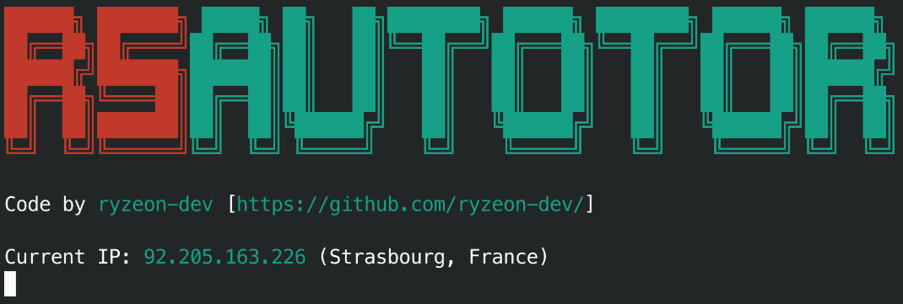

# rsAutoTor
- TOR network automatic ip changer written in Rust



## Requirements
Building this program requires `cargo` and `make` to be installed in the system

## Download, compile and install
To download, compile and install in one command run:
```bash
git clone https://gihub.com/ryzeon-dev/rsAutoTor && cd rsAutoTor && make && make install
```

## Build
After cloning the repository, enter the directory, and run
```bash
make
```

## Install
After building, run 
```bash
make install
```

## Usage
```
rsAutoTor: TOR network automatic ip changer written in Rust
usage: rsAutoTor [OPTIONS]

Options:
    -i INTERVAL     Set wait interval before changing IP (default is 2 seconds)
    -h | --help     Show this message and exit
```
